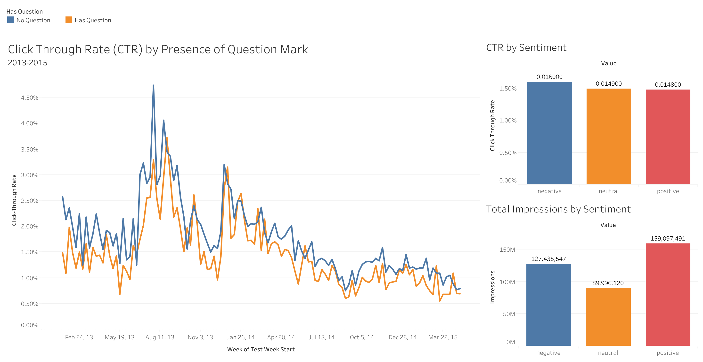

# CTR-OSF-Data-Dashboard
Dashboard visualization and experimental design of OSF Experimental Data testing how varieties of certain headlines warrant more webpage clicks

# Do Question Marks Hurt Click-Through Rates? An A/B Test Analysis of 100K+ Upworthy Headlines

## Overview
A causal analysis of the [Upworthy Research Archive](https://osf.io/jd64p/) — 
105,551 headline variants across 22,743 randomized A/B tests run by Upworthy 
between 2013–2015. This project combines SQL, NLP feature engineering, and 
statistical hypothesis testing to identify which headline characteristics 
actually drove clicks — and which "significant" effects were too small to matter.

**[→ View the interactive dashboard on Tableau Public](https://public.tableau.com/app/profile/dash.kwan/viz/CTR-OSFUpworthyResearch/Dashboard1?publish=yes)**

## The Question
Does the *language* of a headline, not just the story, causally affect 
click-through rate? And can standard statistical significance mislead you 
about which effects are worth acting on?

## Methodology

### Data
- Source: Upworthy Research Archive (confirmatory split), 105,551 packages 
  across 22,743 tests, Jan 2013–Apr 2015
- Each test = multiple headline variants for the same article, randomly 
  shown to different visitors — real randomization, not observational data

### Defining Treatment/Control
The dataset has no built-in treatment/control label — headlines within a 
test just compete against each other. Rather than an arbitrary split (e.g., 
"first created = control"), treatment/control was defined **per engineered 
NLP feature**:
- `has_question` — presence of "?"
- `has_number` — presence of a digit
- `sentiment` — VADER compound score, bucketed negative/neutral/positive

This makes each comparison a real hypothesis test ("does X feature affect 
CTR?") rather than an arbitrary label, while still inheriting the real 
randomization within each test.

### Pipeline
1. **SQL (SQLite)** — raw packages loaded into a `packages` table; NLP 
   features engineered separately into `headline_features`, joined on 
   `package_id`. Aggregation, stratification, and window-function ranking 
   done in SQL, not pandas.
2. **NLP (Python, VADER)** — sentiment scoring and regex-based feature 
   extraction on headline text
3. **Statistics (Python, statsmodels/scipy)** — two-proportion z-tests, 
   effect size, and 95% confidence intervals for each feature — not just 
   p-values
4. **Visualization (Tableau)** — trend and comparison dashboards

## Key Findings

| Feature comparison | p-value | Absolute Δ CTR | Relative lift | 
|---|---|---|---|
| No question mark vs. question mark | <0.001 | 0.205 pts | **15.1%** |
| Negative vs. positive sentiment | <0.001 | 0.119 pts | **8.0%** |
| Has number vs. no number | <0.001 | 0.015 pts | 1.0% |

**All three effects were statistically significant** — expected, given 
sample sizes in the hundreds of millions of impressions gave enormous 
statistical power. But effect size tells a different story: **question 
marks in headlines were associated with a 15% relative drop in CTR**, 
a meaningful and actionable effect. Presence of a number, while 
technically significant, had a negligible ~1% effect — a good example 
of statistical significance without practical significance.

The has_question effect held up consistently when stratified by 
sentiment (negative, neutral, and positive headlines all showed the 
same direction of effect), strengthening confidence this isn't an 
artifact of headline tone.

**Positive headlines received the most impressions of any sentiment 
group, despite having the lowest CTR** — a case where volume and 
quality of engagement diverge.

## Recommendation
[Your stakeholder-style takeaway — e.g., "Editorial teams optimizing 
for engagement should avoid question-mark framing and consider that 
negative/urgent framing modestly outperforms positive framing, while 
including numbers is not a reliable lever."]

## Limitations
- Comparisons across different tests are more observational; the 
  strongest causal claims apply within-test
- [Mention the June 2024 randomization-bug erratum if relevant to 
  your subset]

## Tools
Python (pandas, VADER, statsmodels, scipy) · SQLite · Tableau
